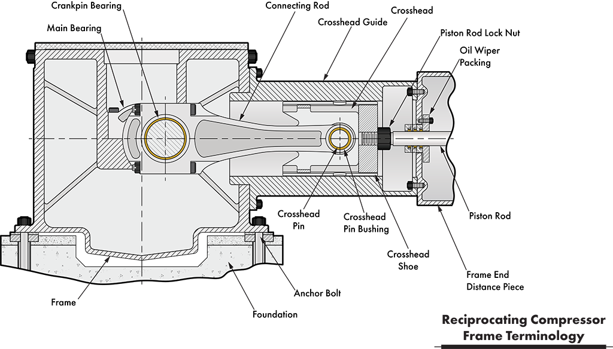
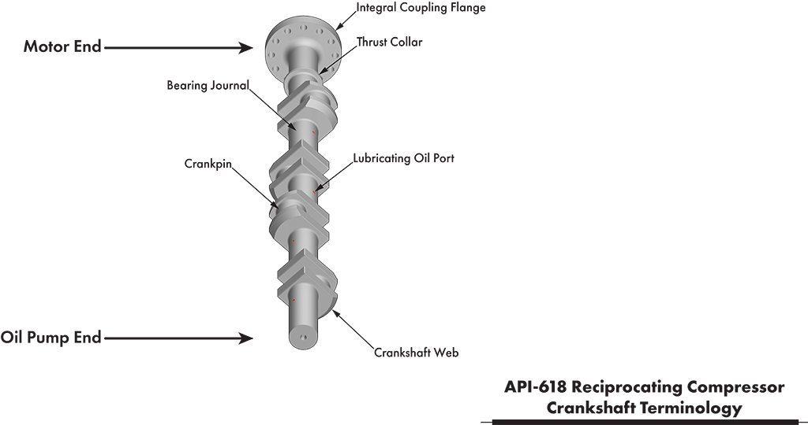
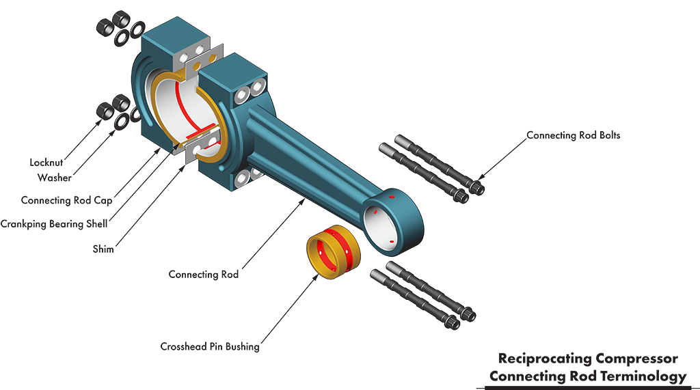

# Reciprocating Compressor Kinematics

This GitHub repository stores source and test code for kinematic analytics of reciprocating compressors.

The sections below provide descriptions of Mathematica worksheets, MATLAB scripts, and Jupyter notebooks. Additionally, I plan to include examples in the repository showing how to use the libraries.

# Source Code Contents

## Mathematica

### [SliderDisp.nb](https://github.com/MoreCoffee12/Reciprocating_Compressor/blob/master/Mathematica%20Reference%20Documents/SliderDisp.nb)

This worksheet derives the governing equations of motion for the piston (slider) displacement.

## MATLAB

### [PlotCrankAngle.m](https://github.com/MoreCoffee12/Reciprocating_Compressor/blob/master/MATLAB/PlotCrankAngle.m)

This function plots reciprocating machinery data in the crank angle domain with the first sample at top dead center (TDC).

\<\< render and insert example crank angle domain plot here \>\>

# Kinematics

The term kinematics describes the measurements and properties used by the physics-based models to simulate compressor behavior.

# Background

The software references terms and nomenclature related to reciprocating machinery. Specifically, the software code primarily addresses API-618 reciprocating compressors. These compressors have numerous subassemblies and moving parts (see [this page](https://robotsquirrelproductions.com/reciprocating-compressors/#recip-piston-basic-elements) for more construction details). This section explains those subassemblies and provides definitions for some commonly encountered parts.

## Frame

The frame encompasses all static components of the machine, including supports, cylinders, heads, distance pieces, crosshead guides, crankcase, bolting, and the foundation (as shown in the figure below). These components work together to transfer power from the crankshaft to the compressed gas.

Figure 1 - A line drawing showing a cross-section of a reciprocating compressor frame (original vector image from [Adobe Stock](https://stock.adobe.com/) File ID: [1371580174](https://stock.adobe.com/stock-photo/id/1371580174?asset_id=1371580174)).

### Crankshaft

The prime mover, a motor, turbine, or reciprocating internal combustion engine, drives the crankshaft. It serves as the first principal element in the basic compressor mechanism. Along with the connecting rod, the crankshaft webs convert rotational energy into linear motion.

In addition, the crankshaft supports other essential functions. For example, most OEMs install a flywheel at the drive end of the crankshaft to reduce torsional forces within the system. Furthermore, the crankshaft’s non-drive end often drives, either directly or through a chain, the frame’s lube oil pump. Lastly, the crankshaft carries oil from the main bearings to the crank pin bearings via cross-drill passages.

Figure 2 - API-618 reciprocating compressor 4-throw crankshaft with integral coupling flange (original vector image from [Adobe Stock](https://stock.adobe.com/) File ID: [1542172192](https://stock.adobe.com/stock-photo/id/1542172192)).

### Connecting Rod

The connecting rod transfers force from the crank pin to the crosshead. Since the crank pin rotates and the crosshead pin moves in a line, the connecting rod has a complex movement path. Generally, the connecting rod center of gravity forms an ellipse (Den Hartog, “[Mechanical Vibrations](https://www.amazon.com/Mechanical-Vibrations-Dover-Civil-Engineering/dp/0486647854/?_encoding=UTF8&pd_rd_w=6WrYm&content-id=amzn1.sym.255b3518-6e7f-495c-8611-30a58648072e%3Aamzn1.symc.a68f4ca3-28dc-4388-a2cf-24672c480d8f&pf_rd_p=255b3518-6e7f-495c-8611-30a58648072e&pf_rd_r=44P04C13R4BK0KMV2NCX&pd_rd_wg=k2i1s&pd_rd_r=0fe04ccb-a8c6-4587-8427-cdb0645f9f19&ref_=pd_hp_d_atf_ci_mcx_mr_ca_hp_atf_d)“). Connecting rods have a crank pin bearing and a bushing for the crosshead pin, providing a path for oil to travel from the crank pin to the crosshead pin, as shown in the figure below.

Figure 3 - [API-618](https://www.apiwebstore.org/standards/618) reciprocating compressor connecting rod assembly (original vector image from [Adobe Stock](https://stock.adobe.com/) File ID: [462500649](https://stock.adobe.com/stock-photo/id/1462500649)).
